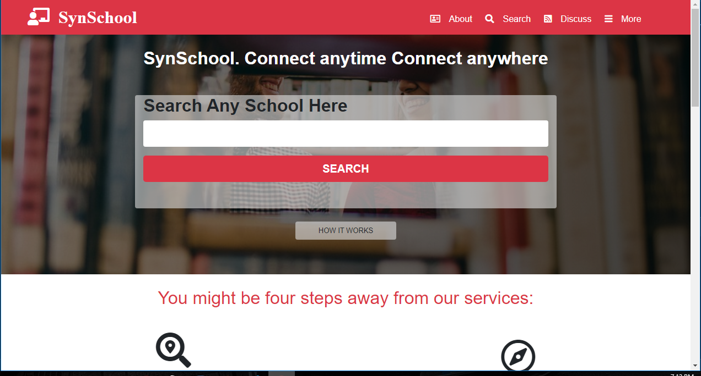
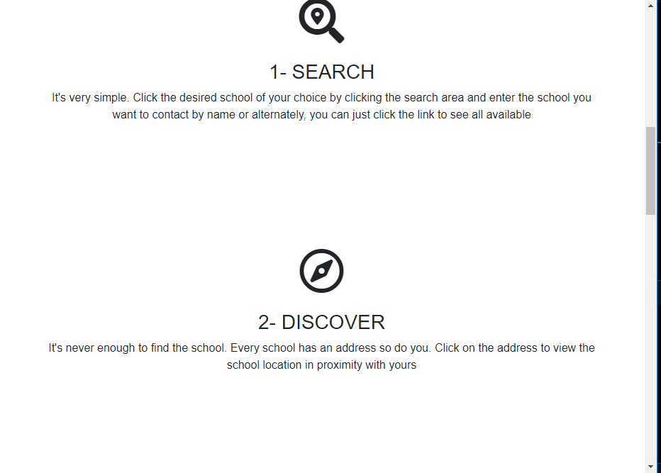
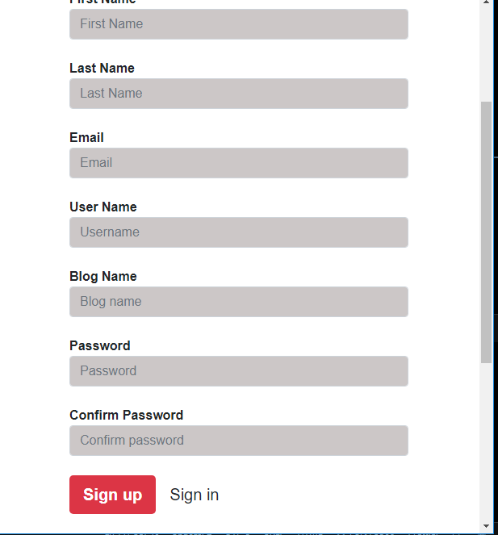

# Directory-of-schools
A directory for schools that allows parents and teachers connect. It allows the school management to access the parents feedback on issues regarding their children and ward. This will be available to all schools in the globe. It is built with basic front end technologies: HTML5, CSS3  and BOOTSTRAP5.

# HTML & CSS CAP STONE PROJECT: DIRECTORY OF SCHOOL.

I applied botstrap all through out the project to achieve the desired lay out for the major 3 screen sizes.

## Built With

- HTML & CSS.
- Media queries
- Bootstrap

## Live Demo

[Live Demo Link](https://promise-j.github.io/Directory-of-school/)

## Authors

👤 **Promise Johnson**

- GitHub: [promise-J](https://github.com/promise-J)
- Twitter: [@Promise94353263](https://twitter.com/Promise94353263)
- LinkedIn: [LinkedIn](https://www.linkedin.com/in/promise-chiemela-788887142)

## Acknowledgement
Microverse.
Stand Up team
Mentor : Alicia
Mathew Njuguna and others on Behance

## 🤝 Contributing

Contributions, issues, and feature requests are welcome!

## Show your support
I want to dedicate this project to the author Mathew Njuguna. This was a very creative work. Thank you for your support too.
Give a ⭐️ if you like this project!

## 📝 License

This project is [MIT] licensed.
Copyright (c) 2021 Promise Johnson 

Permission is hereby granted, free of charge, to any person obtaining a copy of this software and associated documentation files (the "Software"), to deal in the Software without restriction, including without limitation the rights to use, copy, modify, merge, publish, distribute, sublicense, and/or sell copies of the Software, and to permit persons to whom the Software is furnished to do so, subject to the following conditions:

The above copyright notice and this permission notice shall be included in all copies or substantial portions of the Software.

THE SOFTWARE IS PROVIDED "AS IS", WITHOUT WARRANTY OF ANY KIND, EXPRESS OR IMPLIED, INCLUDING BUT NOT LIMITED TO THE WARRANTIES OF MERCHANTABILITY, FITNESS FOR A PARTICULAR PURPOSE AND NONINFRINGEMENT. IN NO EVENT SHALL THE AUTHORS OR COPYRIGHT HOLDERS BE LIABLE FOR ANY CLAIM, DAMAGES OR OTHER LIABILITY, WHETHER IN AN ACTION OF CONTRACT, TORT OR OTHERWISE, ARISING FROM, OUT OF OR IN CONNECTION WITH THE SOFTWARE OR THE USE OR OTHER DEALINGS IN THE SOFTWARE.